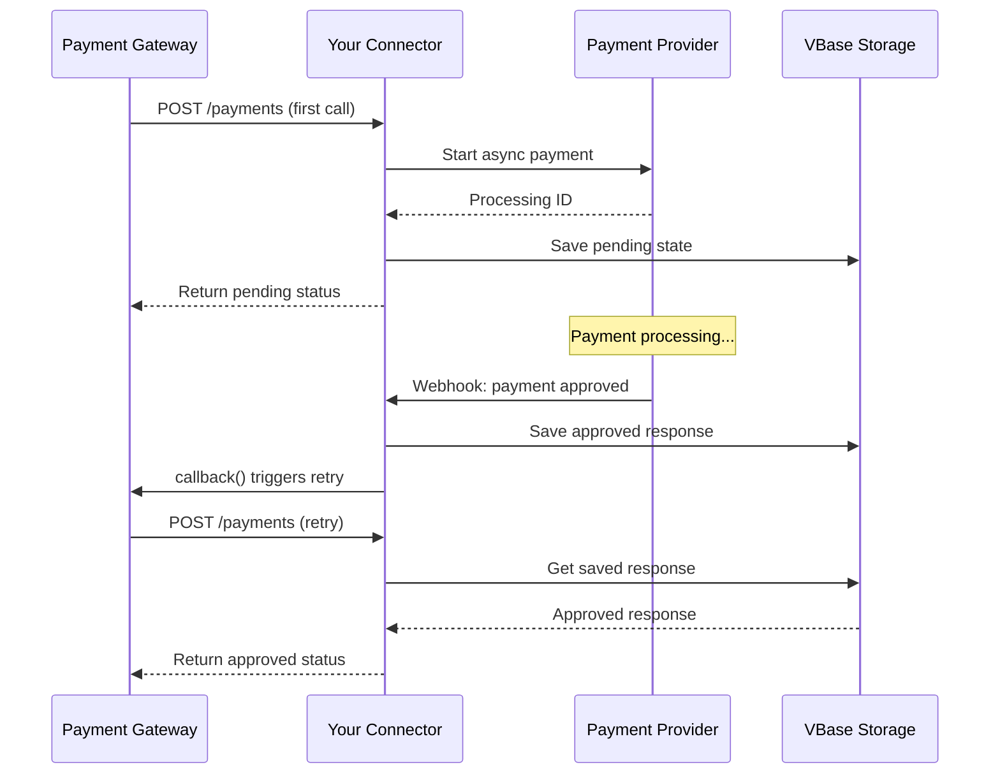

The retry mechanism allows your payment connector to request that VTEX Payment Gateway retry the authorization request when processing asynchronous payments.

## Overview

When a payment requires asynchronous processing (like bank invoices or redirect flows), your connector can return a pending status and use the retry mechanism to notify the gateway when to check for updates.

<Info>
  The retry flow replaces the deprecated callback flow. Payment providers implemented using VTEX IO cannot callback the Payment Gateway directly. Instead, they request a retry, asking the gateway to call the authorization route again.
</Info>

## How retry works

The retry mechanism follows this flow:

<Steps>
  <Step title="Return pending status">
    Your connector receives an authorization request and determines it requires async processing.
  </Step>

  <Step title="Trigger retry">
    The connector calls the `callback()` method with the final payment status and returns a pending response.
  </Step>

  <Step title="Gateway retries">
    The Payment Gateway calls your authorization endpoint again with the same `paymentId`.
  </Step>

  <Step title="Return final status">
    Your connector recognizes the retry (using VBase or another storage) and returns the final approved/denied status.
  </Step>
</Steps>

<Note>
  The connector must be able to respond with the final status consistently when the gateway retries the request.
</Note>

## Implementation

Here's the complete implementation from the example connector:

```typescript node/connector.ts
import {
  AuthorizationRequest,
  AuthorizationResponse,
  PaymentProvider,
} from '@vtex/payment-provider'
import { VBase } from '@vtex/api'

const authorizationsBucket = 'authorizations'

const persistAuthorizationResponse = async (
  vbase: VBase,
  resp: AuthorizationResponse
) => vbase.saveJSON(authorizationsBucket, resp.paymentId, resp)

const getPersistedAuthorizationResponse = async (
  vbase: VBase,
  req: AuthorizationRequest
) =>
  vbase.getJSON<AuthorizationResponse | undefined>(
    authorizationsBucket,
    req.paymentId,
    true
  )

export default class TestSuiteApprover extends PaymentProvider {
  private async saveAndRetry(
    req: AuthorizationRequest,
    resp: AuthorizationResponse
  ) {
    await persistAuthorizationResponse(this.context.clients.vbase, resp)
    this.callback(req, resp)
  }

  public async authorize(
    authorization: AuthorizationRequest
  ): Promise<AuthorizationResponse> {
    // Check if we already processed this payment
    const persistedResponse = await getPersistedAuthorizationResponse(
      this.context.clients.vbase,
      authorization
    )

    if (persistedResponse !== undefined && persistedResponse !== null) {
      // Return the previously stored result
      return persistedResponse
    }

    // First time processing - execute and save for retry
    return executeAuthorization(authorization, response =>
      this.saveAndRetry(authorization, response)
    )
  }
}
```

<Info>
  This code is from `node/connector.ts:41-64` in the example repository.
</Info>

## Async payment flows

The example connector demonstrates several async payment flows:

### Async approved

```typescript node/flow.ts
AsyncApproved: (request, retry) => {
  retry(
    Authorizations.approve(request, {
      authorizationId: randomString(),
      nsu: randomString(),
      tid: randomString(),
    })
  )

  return Authorizations.pending(request, {
    delayToCancel: 1000,
    tid: randomString(),
  })
}
```

### Async denied

```typescript node/flow.ts
AsyncDenied: (request, retry) => {
  retry(Authorizations.deny(request, { tid: randomString() }))

  return Authorizations.pending(request, {
    delayToCancel: 1000,
    tid: randomString(),
  })
}
```

### Bank invoice

```typescript node/flow.ts
BankInvoice: (request, retry) => {
  retry(
    Authorizations.approve(request, {
      authorizationId: randomString(),
      nsu: randomString(),
      tid: randomString(),
    })
  )

  return Authorizations.pendingBankInvoice(request, {
    delayToCancel: 1000,
    paymentUrl: randomUrl(),
    tid: randomString(),
  })
}
```

### Redirect flow

```typescript node/flow.ts
Redirect: (request, retry) => {
  retry(
    Authorizations.approve(request, {
      authorizationId: randomString(),
      nsu: randomString(),
      tid: randomString(),
    })
  )

  return Authorizations.redirect(request, {
    delayToCancel: 1000,
    redirectUrl: randomUrl(),
    tid: randomString(),
  })
}
```

<Info>
  These flow examples are from `node/flow.ts:39-93` in the example repository.
</Info>

## Using VBase for persistence

VBase is VTEX's key-value storage service, ideal for persisting payment states:

<Steps>
  <Step title="Add VBase policy">
    Ensure your `manifest.json` includes the VBase policy:

    ```json manifest.json
    {
      "policies": [
        {
          "name": "vbase-read-write"
        }
      ]
    }
    ```
  </Step>

  <Step title="Create storage helpers">
    Implement functions to save and retrieve payment responses:

    ```typescript node/utils/storage.ts
    import { VBase } from '@vtex/api'
    import { AuthorizationResponse } from '@vtex/payment-provider'

    const BUCKET = 'payment-authorizations'

    export const savePaymentResponse = async (
      vbase: VBase,
      response: AuthorizationResponse
    ) => {
      await vbase.saveJSON(BUCKET, response.paymentId, response)
    }

    export const getPaymentResponse = async (
      vbase: VBase,
      paymentId: string
    ): Promise<AuthorizationResponse | null> => {
      return vbase.getJSON<AuthorizationResponse>(BUCKET, paymentId, true)
    }
    ```
  </Step>

  <Step title="Use in connector">
    Access VBase through the context:

    ```typescript node/connector.ts
    public async authorize(
      request: AuthorizationRequest
    ): Promise<AuthorizationResponse> {
      const vbase = this.context.clients.vbase

      // Check for existing response
      const existing = await getPaymentResponse(vbase, request.paymentId)
      if (existing) {
        return existing
      }

      // Process new payment
      const response = await this.processPayment(request)
      await savePaymentResponse(vbase, response)

      return response
    }
    ```
  </Step>
</Steps>

## Callback method

The `callback()` method is inherited from the `PaymentProvider` base class:

```typescript
this.callback(request: AuthorizationRequest, response: AuthorizationResponse)
```

### Parameters

- `request`: The original authorization request
- `response`: The final payment status to return on retry

### Example usage

```typescript node/connector.ts
import {
  PaymentProvider,
  AuthorizationRequest,
  AuthorizationResponse,
  Authorizations,
} from '@vtex/payment-provider'

export default class MyConnector extends PaymentProvider {
  public async authorize(
    request: AuthorizationRequest
  ): Promise<AuthorizationResponse> {
    // Start async processing
    const processingId = await this.context.clients.paymentApi.startPayment({
      amount: request.value,
      currency: request.currency,
    })

    // Set up webhook to detect completion
    this.setupWebhook(processingId, async (finalStatus) => {
      const finalResponse = finalStatus === 'approved'
        ? Authorizations.approve(request, {
            authorizationId: processingId,
            nsu: randomString(),
            tid: randomString(),
          })
        : Authorizations.deny(request)

      // Save for retry
      await this.saveResponse(request.paymentId, finalResponse)

      // Trigger retry
      this.callback(request, finalResponse)
    })

    // Return pending immediately
    return Authorizations.pending(request, {
      delayToCancel: 5000,
      tid: processingId,
    })
  }
}
```

## Retry flow diagram



## Best practices

<AccordionGroup>
  <Accordion title="Always persist before callback">
    Ensure the final response is saved before calling `callback()`:

    ```typescript
    // ✅ Correct order
    await this.saveResponse(paymentId, finalResponse)
    this.callback(request, finalResponse)

    // ❌ Wrong order (retry might fail)
    this.callback(request, finalResponse)
    await this.saveResponse(paymentId, finalResponse)
    ```
  </Accordion>

  <Accordion title="Handle missing persisted responses">
    Always handle cases where the persisted response might not exist:

    ```typescript
    const persisted = await getPaymentResponse(vbase, request.paymentId)

    if (persisted !== undefined && persisted !== null) {
      return persisted
    }

    // Process new payment
    ```
  </Accordion>

  <Accordion title="Set appropriate delay to cancel">
    Use `delayToCancel` to specify how long to wait before auto-canceling:

    ```typescript
    return Authorizations.pending(request, {
      delayToCancel: 300000, // 5 minutes in milliseconds
      tid: transactionId,
    })
    ```
  </Accordion>

  <Accordion title="Use unique payment IDs">
    Rely on `paymentId` as the unique identifier for storage:

    ```typescript
    // ✅ Use paymentId from request
    const key = request.paymentId

    // ❌ Don't generate your own keys
    const key = `payment-${Date.now()}`
    ```
  </Accordion>

  <Accordion title="Log retry attempts">
    Track retry behavior for debugging:

    ```typescript
    const persisted = await getPaymentResponse(vbase, request.paymentId)

    if (persisted) {
      console.log(`Retry detected for payment ${request.paymentId}`)
      return persisted
    }

    console.log(`First attempt for payment ${request.paymentId}`)
    ```
  </Accordion>
</AccordionGroup>

## Testing retry mechanism

```typescript __tests__/retry.test.ts
import { describe, test, expect, jest } from '@jest/globals'
import TestSuiteApprover from '../connector'
import { AuthorizationRequest, Authorizations } from '@vtex/payment-provider'

describe('Retry Mechanism', () => {
  test('should return persisted response on retry', async () => {
    const connector = new TestSuiteApprover(mockContext)

    const request: AuthorizationRequest = {
      paymentId: 'test-payment-123',
      value: 10000,
      currency: 'BRL',
    }

    // First call - process and return pending
    const firstResponse = await connector.authorize(request)
    expect(firstResponse.status).toBe('pending')

    // Wait for async processing (simulated)
    await new Promise(resolve => setTimeout(resolve, 100))

    // Retry - should return final status
    const retryResponse = await connector.authorize(request)
    expect(retryResponse.status).toBe('approved')
    expect(retryResponse.paymentId).toBe(request.paymentId)
  })

  test('should handle multiple retries', async () => {
    const connector = new TestSuiteApprover(mockContext)

    const request: AuthorizationRequest = {
      paymentId: 'test-payment-456',
      value: 10000,
      currency: 'BRL',
    }

    // First call
    await connector.authorize(request)

    // Multiple retries should return same result
    const retry1 = await connector.authorize(request)
    const retry2 = await connector.authorize(request)
    const retry3 = await connector.authorize(request)

    expect(retry1).toEqual(retry2)
    expect(retry2).toEqual(retry3)
  })
})
```

## Troubleshooting

### Payment stuck in pending

If payments remain pending:

1. Verify `callback()` is being called after saving the response
2. Check VBase policies in `manifest.json`
3. Ensure `paymentId` is used consistently as the storage key
4. Verify the persisted response structure matches `AuthorizationResponse`

### Callback not triggering retry

If the gateway doesn't retry:

1. Ensure you're calling `this.callback()` (not creating a new instance)
2. Verify the request object passed to callback matches the original
3. Check outbound access policy for callback endpoint
4. Review logs for callback errors

### VBase storage errors

If VBase operations fail:

1. Confirm `vbase-read-write` policy in manifest
2. Check bucket name consistency
3. Verify VBase client is available in context
4. Handle VBase errors gracefully with try/catch

## Related resources

- [Authorization Route](/api/routes/authorize)
- [VBase Documentation](https://developers.vtex.com/docs/guides/vbase-overview)
- [Payment Provider Protocol](https://help.vtex.com/en/tutorial/payment-provider-protocol)
- [Payment Flows](/concepts/payment-flows)