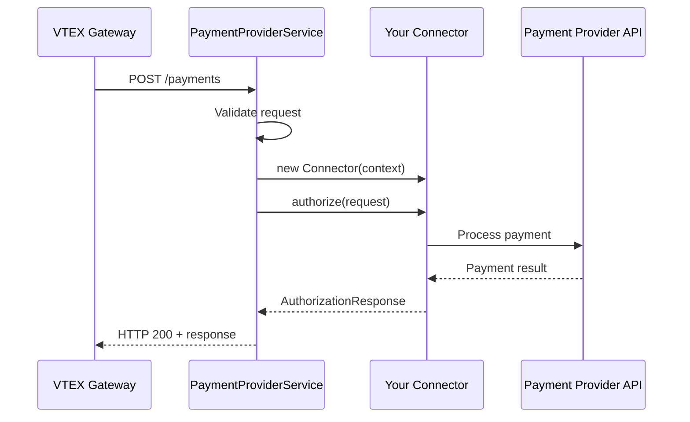

## Overview

The `PaymentProviderService` class is responsible for registering your payment provider connector with the VTEX IO runtime. It handles HTTP routing, request validation, and connects your `PaymentProvider` implementation to the VTEX Payment Gateway.

## Class signature

```typescript
class PaymentProviderService {
  constructor(options: PaymentProviderServiceOptions)
}

interface PaymentProviderServiceOptions {
  connector: typeof PaymentProvider
  timeout?: number
}
```

## Constructor

Creates a new payment provider service instance and registers it with the VTEX IO runtime.

### Parameters

<ParamField path="options" type="PaymentProviderServiceOptions" required>
  Configuration object for the service
</ParamField>

<ParamField path="options.connector" type="typeof PaymentProvider" required>
  The connector class that extends `PaymentProvider`. This is the class constructor, not an instance.
</ParamField>

<ParamField path="options.timeout" type="number" default={10000}>
  Optional timeout in milliseconds for payment operations. Defaults to 10 seconds.
</ParamField>

## Usage

### Basic setup

The service is typically instantiated in your `node/index.ts` file:

```typescript node/index.ts
import { PaymentProviderService } from '@vtex/payment-provider'
import TestSuiteApprover from './connector'

export default new PaymentProviderService({
  connector: TestSuiteApprover,
})
```

<Note>
  Pass the class itself (constructor), not an instance. The service will instantiate your connector for each request.
</Note>

### With custom timeout

For payment providers that require longer processing times:

```typescript node/index.ts
import { PaymentProviderService } from '@vtex/payment-provider'
import SlowPaymentProvider from './connector'

export default new PaymentProviderService({
  connector: SlowPaymentProvider,
  timeout: 30000, // 30 seconds
})
```

<Warning>
  VTEX recommends keeping timeouts under 15 seconds to prevent gateway timeouts. For longer operations, use asynchronous flows with callbacks.
</Warning>

## How it works

The `PaymentProviderService` automatically:

1. **Registers HTTP routes** for the Payment Provider Protocol:
   - `POST /payments` - Authorization requests
   - `POST /cancellations` - Cancellation requests
   - `POST /settlements` - Settlement requests
   - `POST /refunds` - Refund requests
   - `POST /inbound` - Webhook notifications (if defined)

2. **Validates requests** according to the Payment Provider Protocol specification

3. **Instantiates your connector** for each request with the proper context

4. **Handles errors** and formats responses according to VTEX standards

5. **Manages timeouts** and ensures responses are sent within the configured limit

## Request flow



## Complete example

<Tabs>
  <Tab title="node/index.ts">
    ```typescript node/index.ts
    import { PaymentProviderService } from '@vtex/payment-provider'
    import TestSuiteApprover from './connector'

    export default new PaymentProviderService({
      connector: TestSuiteApprover,
    })
    ```
  </Tab>
  
  <Tab title="node/connector.ts">
    ```typescript node/connector.ts
    import {
      AuthorizationRequest,
      AuthorizationResponse,
      CancellationRequest,
      CancellationResponse,
      PaymentProvider,
      RefundRequest,
      RefundResponse,
      SettlementRequest,
      SettlementResponse,
      Cancellations,
      Refunds,
      Settlements,
    } from '@vtex/payment-provider'

    import { executeAuthorization } from './flow'
    import { randomString } from './utils'

    export default class TestSuiteApprover extends PaymentProvider {
      public async authorize(
        authorization: AuthorizationRequest
      ): Promise<AuthorizationResponse> {
        if (this.isTestSuite) {
          return executeAuthorization(authorization, response =>
            this.callback(authorization, response)
          )
        }

        throw new Error('Not implemented')
      }

      public async cancel(
        cancellation: CancellationRequest
      ): Promise<CancellationResponse> {
        if (this.isTestSuite) {
          return Cancellations.approve(cancellation, {
            cancellationId: randomString(),
          })
        }

        throw new Error('Not implemented')
      }

      public async refund(
        refund: RefundRequest
      ): Promise<RefundResponse> {
        if (this.isTestSuite) {
          return Refunds.deny(refund)
        }

        throw new Error('Not implemented')
      }

      public async settle(
        settlement: SettlementRequest
      ): Promise<SettlementResponse> {
        if (this.isTestSuite) {
          return Settlements.deny(settlement)
        }

        throw new Error('Not implemented')
      }

      public inbound: undefined
    }
    ```
  </Tab>
  
  <Tab title="manifest.json">
    ```json manifest.json
    {
      "name": "payment-provider-example",
      "vendor": "vtex",
      "version": "1.2.0",
      "title": "Payment Provider Example",
      "description": "Reference app for Payment-Provider protocol implementers",
      "builders": {
        "paymentProvider": "1.x",
        "node": "6.x"
      },
      "policies": [
        {
          "name": "vbase-read-write"
        },
        {
          "name": "colossus-fire-event"
        },
        {
          "name": "outbound-access",
          "attrs": {
            "host": "heimdall.vtexpayments.com.br",
            "path": "/api/payment-provider/callback/*"
          }
        }
      ]
    }
    ```
  </Tab>
</Tabs>

## Error handling

The service automatically handles common error scenarios:

### Timeout errors

```typescript
// If your connector takes too long
public async authorize(
  authorization: AuthorizationRequest
): Promise<AuthorizationResponse> {
  // This operation takes 20 seconds but timeout is 10 seconds
  await longRunningOperation()
  
  // Service will return timeout error to VTEX Gateway
}
```

**Solution:** Use asynchronous flows for long-running operations:

```typescript
public async authorize(
  authorization: AuthorizationRequest
): Promise<AuthorizationResponse> {
  // Start async operation
  this.startAsyncOperation(authorization)
  
  // Return pending immediately
  return Authorizations.pending(authorization, {
    delayToCancel: 300000,
    tid: 'transaction-id',
  })
}

private async startAsyncOperation(auth: AuthorizationRequest) {
  // Process in background
  const result = await longRunningOperation()
  
  // Send result via callback
  this.callback(auth, Authorizations.approve(auth, result))
}
```

### Validation errors

```typescript
// Invalid response format will be caught
public async authorize(
  authorization: AuthorizationRequest
): Promise<AuthorizationResponse> {
  // Don't return plain objects - use helper methods
  return {
    status: 'approved', // ❌ Wrong
    paymentId: authorization.paymentId,
  }
  
  // Use helper methods instead
  return Authorizations.approve(authorization, { // ✅ Correct
    authorizationId: 'auth-id',
  })
}
```

### Runtime errors

```typescript
public async authorize(
  authorization: AuthorizationRequest
): Promise<AuthorizationResponse> {
  try {
    const result = await this.paymentGateway.process(authorization)
    return Authorizations.approve(authorization, result)
  } catch (error) {
    // Log error for debugging
    console.error('Payment processing failed:', error)
    
    // Return denial to VTEX
    return Authorizations.deny(authorization, {
      tid: 'error',
    })
  }
}
```

## Environment context

Your connector receives a context object with VTEX IO runtime information:

```typescript
export default class MyConnector extends PaymentProvider {
  public async authorize(
    authorization: AuthorizationRequest
  ): Promise<AuthorizationResponse> {
    // Access VTEX context
    const { account, workspace } = this.context.vtex
    
    // Access pre-configured clients
    const vbase = this.context.clients.vbase
    
    // Use VBase for persistence
    await vbase.saveJSON('bucket', 'key', { data: 'value' })
    
    // ...
  }
}
```

## Testing

The service integrates with VTEX's test suite. Use the `isTestSuite` property to enable test-specific behavior:

```typescript node/connector.ts
export default class TestSuiteApprover extends PaymentProvider {
  public async authorize(
    authorization: AuthorizationRequest
  ): Promise<AuthorizationResponse> {
    if (this.isTestSuite) {
      // Test suite specific logic
      return executeAuthorization(authorization, response =>
        this.callback(authorization, response)
      )
    }

    // Production logic
    throw new Error('Not implemented')
  }
}
```

<Note>
  The test suite validates that your connector implements the Payment Provider Protocol correctly. Passing the test suite is required before your connector can be used in production.
</Note>

## See also

<CardGroup cols={2}>
  <Card title="PaymentProvider" icon="code" href="/api/payment-provider">
    Learn about the abstract class your connector extends
  </Card>
  <Card title="Configuration" icon="sliders" href="/guides/configuration">
    Configure your payment provider settings
  </Card>
  <Card title="Testing" icon="flask" href="/deployment/testing">
    Test your connector with the VTEX test suite
  </Card>
  <Card title="Deployment" icon="rocket" href="/deployment/publishing">
    Publish your connector to production
  </Card>
</CardGroup>