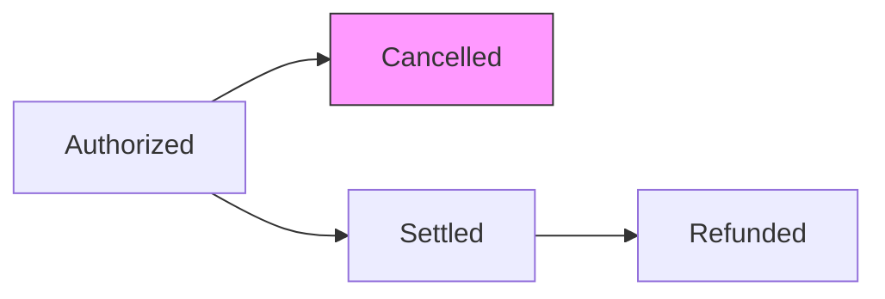

## Overview

The `cancel()` method handles cancellation requests for authorized payments that have not yet been settled. This is typically called when a customer cancels an order or when a payment needs to be voided before capture.

## Method signature

```typescript
public async cancel(
  cancellation: CancellationRequest
): Promise<CancellationResponse>
```

## Parameters

<ParamField path="cancellation" type="CancellationRequest" required>
  The cancellation request object from VTEX.

  <ParamField path="cancellation.paymentId" type="string" required>
    Unique identifier for the original payment transaction
  </ParamField>

  <ParamField path="cancellation.requestId" type="string" required>
    Unique identifier for this cancellation request
  </ParamField>

  <ParamField path="cancellation.authorizationId" type="string" optional>
    Authorization identifier from the original authorization response
  </ParamField>

  <ParamField path="cancellation.value" type="number" optional>
    Amount to cancel in cents (may be partial)
  </ParamField>

  <ParamField path="cancellation.tid" type="string" optional>
    Transaction identifier from the original authorization
  </ParamField>
</ParamField>

## Response

<ResponseField name="response" type="CancellationResponse">
  The cancellation response indicating the result of the cancellation request.

  <ResponseField name="paymentId" type="string" required>
    Echo of the payment identifier from the request
  </ResponseField>

  <ResponseField name="cancellationId" type="string" optional>
    Unique identifier for this cancellation (present when approved)
  </ResponseField>

  <ResponseField name="code" type="string" optional>
    Response code from the payment provider
  </ResponseField>

  <ResponseField name="message" type="string" optional>
    Human-readable message describing the cancellation result
  </ResponseField>

  <ResponseField name="requestId" type="string" required>
    Echo of the request identifier from the request
  </ResponseField>
</ResponseField>

## Response types

<Tabs>
  <Tab title="Approved">
    Cancellation was successfully processed.

    ```typescript
    {
      paymentId: "ABC123",
      requestId: "REQ-456",
      cancellationId: "CANCEL-789",
      code: "success",
      message: "Cancellation approved"
    }
    ```
  </Tab>

  <Tab title="Denied">
    Cancellation was rejected by the payment provider.

    ```typescript
    {
      paymentId: "ABC123",
      requestId: "REQ-456",
      code: "cancellation-denied",
      message: "Payment cannot be cancelled"
    }
    ```
  </Tab>
</Tabs>

## Implementation

The test suite implementation shows the basic pattern:

<CodeGroup>
```typescript connector.ts
public async cancel(
  cancellation: CancellationRequest
): Promise<CancellationResponse> {
  if (this.isTestSuite) {
    return Cancellations.approve(cancellation, {
      cancellationId: randomString(),
    })
  }

  throw new Error('Not implemented')
}
```

```typescript Usage with helper
import { Cancellations } from '@vtex/payment-provider'

// Approve a cancellation
const response = Cancellations.approve(cancellation, {
  cancellationId: 'CANCEL-12345',
  code: 'success',
  message: 'Cancellation processed'
})

// Deny a cancellation
const response = Cancellations.deny(cancellation, {
  code: 'already-settled',
  message: 'Cannot cancel settled payment'
})
```
</CodeGroup>

## Common scenarios

### Full cancellation

Cancel the entire authorized amount:

```typescript
public async cancel(
  cancellation: CancellationRequest
): Promise<CancellationResponse> {
  try {
    // Call your payment provider's cancellation API
    const providerResponse = await this.paymentProvider.cancelPayment({
      transactionId: cancellation.tid,
      authorizationId: cancellation.authorizationId,
    })

    return Cancellations.approve(cancellation, {
      cancellationId: providerResponse.cancellationId,
      code: providerResponse.code,
      message: 'Payment successfully cancelled',
    })
  } catch (error) {
    return Cancellations.deny(cancellation, {
      code: 'cancellation-failed',
      message: error.message,
    })
  }
}
```

### Partial cancellation

Some payment providers support canceling only part of the authorized amount:

```typescript
public async cancel(
  cancellation: CancellationRequest
): Promise<CancellationResponse> {
  const { value, paymentId, authorizationId } = cancellation

  // Check if partial cancellation is supported
  if (value && value < this.getOriginalAmount(paymentId)) {
    // Partial cancellation logic
    const providerResponse = await this.paymentProvider.partialCancel({
      authorizationId,
      amount: value,
    })

    return Cancellations.approve(cancellation, {
      cancellationId: providerResponse.id,
    })
  }

  // Full cancellation logic
  // ...
}
```

### Idempotent cancellations

Handle duplicate cancellation requests:

```typescript
public async cancel(
  cancellation: CancellationRequest
): Promise<CancellationResponse> {
  // Check if this cancellation was already processed
  const existing = await this.getCancellation(cancellation.requestId)
  
  if (existing) {
    return existing // Return same response for idempotency
  }

  // Process new cancellation
  const response = await this.processCancellation(cancellation)
  
  // Persist for future duplicate requests
  await this.saveCancellation(cancellation.requestId, response)
  
  return response
}
```

## Helper methods

The `@vtex/payment-provider` package provides helper methods for creating responses:

<CodeGroup>
```typescript Approve
import { Cancellations } from '@vtex/payment-provider'

Cancellations.approve(cancellation, {
  cancellationId: 'CANCEL-123',
  code: 'success',
  message: 'Optional success message',
})
```

```typescript Deny
import { Cancellations } from '@vtex/payment-provider'

Cancellations.deny(cancellation, {
  code: 'already-settled',
  message: 'Payment has already been settled',
})
```
</CodeGroup>

## Error handling

<AccordionGroup>
  <Accordion title="Payment not found">
    If the payment ID doesn't exist, deny the cancellation with an appropriate message:

    ```typescript
    return Cancellations.deny(cancellation, {
      code: 'payment-not-found',
      message: 'Original payment not found',
    })
    ```
  </Accordion>

  <Accordion title="Already settled">
    If the payment has already been settled, cancellation is not possible:

    ```typescript
    return Cancellations.deny(cancellation, {
      code: 'already-settled',
      message: 'Cannot cancel settled payment. Use refund instead.',
    })
    ```
  </Accordion>

  <Accordion title="Already cancelled">
    If the payment was already cancelled, return the original cancellation:

    ```typescript
    const existing = await this.getCancellation(cancellation.paymentId)
    if (existing) {
      return existing
    }
    ```
  </Accordion>

  <Accordion title="Provider timeout">
    If the payment provider times out, you can return a pending status or deny:

    ```typescript
    return Cancellations.deny(cancellation, {
      code: 'timeout',
      message: 'Payment provider timeout. Please retry.',
    })
    ```
  </Accordion>
</AccordionGroup>

## Best practices

1. **Always verify payment status** before attempting cancellation. Check that the payment is authorized but not yet settled.

2. **Implement idempotency** by storing cancellation responses and returning the same response for duplicate `requestId` values.

3. **Include meaningful error messages** to help merchants understand why a cancellation was denied.

4. **Log cancellation attempts** for audit trails and troubleshooting.

5. **Handle partial cancellations** if your payment provider supports them.

## Payment lifecycle



Cancellation is only possible for authorized payments. Once settled, use [refund()](/api/routes/refund) instead.

## Related routes

- [authorize()](/api/routes/authorize) - Create the initial authorization
- [settle()](/api/routes/settle) - Settle an authorized payment
- [refund()](/api/routes/refund) - Refund a settled payment
