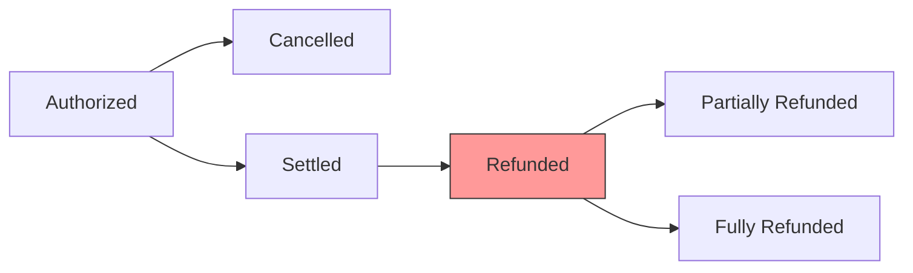

## Overview

The `refund()` method handles refund requests for settled payments. Refunds return money to the customer after a payment has been captured. This typically occurs when a customer returns a product or when an order needs to be reversed after fulfillment.

## Method signature

```typescript
public async refund(
  refund: RefundRequest
): Promise<RefundResponse>
```

## Parameters

<ParamField path="refund" type="RefundRequest" required>
  The refund request object from VTEX.

  <ParamField path="refund.paymentId" type="string" required>
    Unique identifier for the original payment transaction
  </ParamField>

  <ParamField path="refund.requestId" type="string" required>
    Unique identifier for this refund request
  </ParamField>

  <ParamField path="refund.settleId" type="string" optional>
    Settlement identifier from the original settlement response
  </ParamField>

  <ParamField path="refund.value" type="number" required>
    Amount to refund in cents (may be partial)
  </ParamField>

  <ParamField path="refund.tid" type="string" optional>
    Transaction identifier from the original authorization
  </ParamField>
</ParamField>

## Response

<ResponseField name="response" type="RefundResponse">
  The refund response indicating the result of the refund request.

  <ResponseField name="paymentId" type="string" required>
    Echo of the payment identifier from the request
  </ResponseField>

  <ResponseField name="refundId" type="string" optional>
    Unique identifier for this refund (present when approved)
  </ResponseField>

  <ResponseField name="value" type="number" optional>
    Actual amount refunded in cents (may differ from requested amount)
  </ResponseField>

  <ResponseField name="code" type="string" optional>
    Response code from the payment provider
  </ResponseField>

  <ResponseField name="message" type="string" optional>
    Human-readable message describing the refund result
  </ResponseField>

  <ResponseField name="requestId" type="string" required>
    Echo of the request identifier from the request
  </ResponseField>
</ResponseField>

## Response types

<Tabs>
  <Tab title="Approved">
    Refund was successfully processed and funds will be returned.

    ```typescript
    {
      paymentId: "ABC123",
      requestId: "REQ-456",
      refundId: "REFUND-789",
      value: 5000,
      code: "success",
      message: "Refund approved"
    }
    ```
  </Tab>

  <Tab title="Denied">
    Refund was rejected by the payment provider.

    ```typescript
    {
      paymentId: "ABC123",
      requestId: "REQ-456",
      code: "refund-denied",
      message: "Refund period expired"
    }
    ```
  </Tab>
</Tabs>

## Implementation

The test suite implementation shows the basic pattern:

<CodeGroup>
```typescript connector.ts
public async refund(
  refund: RefundRequest
): Promise<RefundResponse> {
  if (this.isTestSuite) {
    return Refunds.deny(refund)
  }

  throw new Error('Not implemented')
}
```

```typescript Production example
import { Refunds } from '@vtex/payment-provider'

public async refund(
  refund: RefundRequest
): Promise<RefundResponse> {
  try {
    // Validate settlement exists
    const settlement = await this.getSettlement(refund.paymentId)
    if (!settlement) {
      return Refunds.deny(refund, {
        code: 'settlement-not-found',
        message: 'Original settlement not found',
      })
    }

    // Call your payment provider's refund API
    const providerResponse = await this.paymentProvider.refundPayment({
      transactionId: refund.tid,
      settleId: refund.settleId,
      amount: refund.value,
    })

    return Refunds.approve(refund, {
      refundId: providerResponse.refundId,
      value: refund.value,
      code: 'success',
    })
  } catch (error) {
    return Refunds.deny(refund, {
      code: 'refund-failed',
      message: error.message,
    })
  }
}
```
</CodeGroup>

## Common scenarios

### Full refund

Refund the entire settled amount:

```typescript
public async refund(
  refund: RefundRequest
): Promise<RefundResponse> {
  const settlement = await this.getSettlement(refund.paymentId)

  if (!settlement) {
    return Refunds.deny(refund, {
      code: 'settlement-not-found',
      message: 'Original settlement not found',
    })
  }

  if (refund.value !== settlement.value) {
    return Refunds.deny(refund, {
      code: 'amount-mismatch',
      message: 'Refund amount must match settlement for full refund',
    })
  }

  const providerResponse = await this.paymentProvider.refund({
    settleId: refund.settleId,
    amount: refund.value,
  })

  return Refunds.approve(refund, {
    refundId: providerResponse.id,
    value: refund.value,
  })
}
```

### Partial refund

Refund only part of the settled amount:

```typescript
public async refund(
  refund: RefundRequest
): Promise<RefundResponse> {
  const settlement = await this.getSettlement(refund.paymentId)
  const previousRefunds = await this.getRefunds(refund.paymentId)

  // Calculate total refunded amount
  const totalRefunded = previousRefunds.reduce(
    (sum, r) => sum + r.value,
    0
  )

  // Validate remaining amount
  const remainingAmount = settlement.value - totalRefunded
  
  if (refund.value > remainingAmount) {
    return Refunds.deny(refund, {
      code: 'insufficient-settled-amount',
      message: `Only ${remainingAmount} cents remaining to refund`,
    })
  }

  const providerResponse = await this.paymentProvider.refund({
    settleId: refund.settleId,
    amount: refund.value,
  })

  return Refunds.approve(refund, {
    refundId: providerResponse.id,
    value: refund.value,
  })
}
```

### Multiple refunds

Handle multiple refund requests for the same payment:

```typescript
public async refund(
  refund: RefundRequest
): Promise<RefundResponse> {
  const settlement = await this.getSettlement(refund.paymentId)
  
  if (!settlement) {
    return Refunds.deny(refund, {
      code: 'settlement-not-found',
      message: 'No settlement found for this payment',
    })
  }

  // Get all previous refunds
  const existingRefunds = await this.getRefunds(refund.paymentId)
  const totalRefunded = existingRefunds.reduce((sum, r) => sum + r.value, 0)
  const availableToRefund = settlement.value - totalRefunded

  if (refund.value > availableToRefund) {
    return Refunds.deny(refund, {
      code: 'amount-exceeds-available',
      message: `Cannot refund ${refund.value}. Available: ${availableToRefund}`,
    })
  }

  // Process the refund
  const providerResponse = await this.paymentProvider.refund({
    settleId: refund.settleId,
    amount: refund.value,
    previousRefunds: existingRefunds.map(r => r.refundId),
  })

  return Refunds.approve(refund, {
    refundId: providerResponse.id,
    value: refund.value,
  })
}
```

### Idempotent refunds

Handle duplicate refund requests:

```typescript
public async refund(
  refund: RefundRequest
): Promise<RefundResponse> {
  // Check if this refund was already processed
  const existing = await this.getRefund(refund.requestId)
  
  if (existing) {
    return existing // Return same response for idempotency
  }

  // Process new refund
  const response = await this.processRefund(refund)
  
  // Persist for future duplicate requests
  await this.saveRefund(refund.requestId, response)
  
  return response
}
```

### Time-based refund validation

Some payment providers have refund windows:

```typescript
public async refund(
  refund: RefundRequest
): Promise<RefundResponse> {
  const settlement = await this.getSettlement(refund.paymentId)
  const settlementDate = new Date(settlement.settledAt)
  const daysSinceSettlement = 
    (Date.now() - settlementDate.getTime()) / (1000 * 60 * 60 * 24)

  // Check if within refund window (e.g., 90 days)
  if (daysSinceSettlement > 90) {
    return Refunds.deny(refund, {
      code: 'refund-period-expired',
      message: 'Refund period has expired (90 days maximum)',
    })
  }

  const providerResponse = await this.paymentProvider.refund({
    settleId: refund.settleId,
    amount: refund.value,
  })

  return Refunds.approve(refund, {
    refundId: providerResponse.id,
    value: refund.value,
  })
}
```

## Helper methods

The `@vtex/payment-provider` package provides helper methods for creating responses:

<CodeGroup>
```typescript Approve
import { Refunds } from '@vtex/payment-provider'

Refunds.approve(refund, {
  refundId: 'REFUND-123',
  value: 5000,
  code: 'success',
  message: 'Optional success message',
})
```

```typescript Deny
import { Refunds } from '@vtex/payment-provider'

Refunds.deny(refund, {
  code: 'refund-period-expired',
  message: 'Refund period has expired',
})
```
</CodeGroup>

## Error handling

<AccordionGroup>
  <Accordion title="Settlement not found">
    If the original settlement doesn't exist:

    ```typescript
    return Refunds.deny(refund, {
      code: 'settlement-not-found',
      message: 'Original settlement not found',
    })
    ```
  </Accordion>

  <Accordion title="Refund period expired">
    If the refund window has passed:

    ```typescript
    return Refunds.deny(refund, {
      code: 'refund-period-expired',
      message: 'Refund period has expired',
    })
    ```
  </Accordion>

  <Accordion title="Already refunded">
    If the full amount has already been refunded:

    ```typescript
    return Refunds.deny(refund, {
      code: 'already-refunded',
      message: 'Payment has already been fully refunded',
    })
    ```
  </Accordion>

  <Accordion title="Amount exceeds settlement">
    If trying to refund more than settled:

    ```typescript
    return Refunds.deny(refund, {
      code: 'amount-exceeds-settlement',
      message: `Cannot refund ${refund.value}. Settled: ${settlement.value}`,
    })
    ```
  </Accordion>

  <Accordion title="Provider error">
    If the payment provider returns an error:

    ```typescript
    return Refunds.deny(refund, {
      code: error.code || 'provider-error',
      message: error.message || 'Refund failed at provider',
    })
    ```
  </Accordion>
</AccordionGroup>

## Best practices

1. **Validate settlement exists** and has been completed before attempting refund.

2. **Check refund windows** - most providers have time limits (typically 90-180 days).

3. **Implement idempotency** by storing refund responses and returning the same response for duplicate `requestId` values.

4. **Support partial refunds** to allow merchants to refund portions of orders.

5. **Track total refunded amount** when supporting multiple refunds for the same settlement.

6. **Include detailed error messages** to help merchants understand refund failures.

7. **Log all refund attempts** for audit trails and accounting reconciliation.

8. **Consider provider-specific limits** - some providers have minimum refund amounts or maximum refund counts.

## Payment lifecycle



Refunds can only occur for settled payments. Once fully refunded, no further operations are possible on the payment.

## Related routes

- [authorize()](/api/routes/authorize) - Create the initial authorization
- [settle()](/api/routes/settle) - Settle an authorized payment (required before refund)
- [cancel()](/api/routes/cancel) - Cancel an authorized payment before settlement
