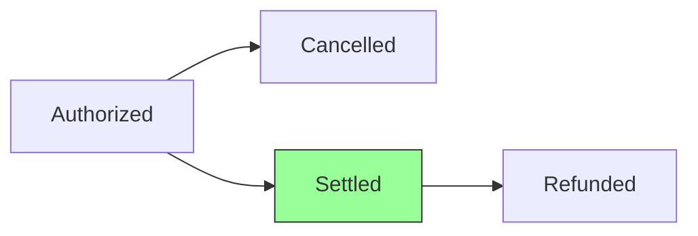

## Overview

The `settle()` method handles settlement (capture) requests for previously authorized payments. Settlement is the process of capturing the authorized funds and initiating the transfer from the customer to the merchant. This typically occurs when an order is invoiced or shipped.

## Method signature

```typescript
public async settle(
  settlement: SettlementRequest
): Promise<SettlementResponse>
```

## Parameters

<ParamField path="settlement" type="SettlementRequest" required>
  The settlement request object from VTEX.

  <ParamField path="settlement.paymentId" type="string" required>
    Unique identifier for the original payment transaction
  </ParamField>

  <ParamField path="settlement.requestId" type="string" required>
    Unique identifier for this settlement request
  </ParamField>

  <ParamField path="settlement.authorizationId" type="string" optional>
    Authorization identifier from the original authorization response
  </ParamField>

  <ParamField path="settlement.value" type="number" required>
    Amount to settle in cents (may be partial)
  </ParamField>

  <ParamField path="settlement.tid" type="string" optional>
    Transaction identifier from the original authorization
  </ParamField>
</ParamField>

## Response

<ResponseField name="response" type="SettlementResponse">
  The settlement response indicating the result of the settlement request.

  <ResponseField name="paymentId" type="string" required>
    Echo of the payment identifier from the request
  </ResponseField>

  <ResponseField name="settleId" type="string" optional>
    Unique identifier for this settlement (present when approved)
  </ResponseField>

  <ResponseField name="value" type="number" optional>
    Actual amount settled in cents (may differ from requested amount)
  </ResponseField>

  <ResponseField name="code" type="string" optional>
    Response code from the payment provider
  </ResponseField>

  <ResponseField name="message" type="string" optional>
    Human-readable message describing the settlement result
  </ResponseField>

  <ResponseField name="requestId" type="string" required>
    Echo of the request identifier from the request
  </ResponseField>
</ResponseField>

## Response types

<Tabs>
  <Tab title="Approved">
    Settlement was successfully processed and funds will be captured.

    ```typescript
    {
      paymentId: "ABC123",
      requestId: "REQ-456",
      settleId: "SETTLE-789",
      value: 10000,
      code: "success",
      message: "Settlement approved"
    }
    ```
  </Tab>

  <Tab title="Denied">
    Settlement was rejected by the payment provider.

    ```typescript
    {
      paymentId: "ABC123",
      requestId: "REQ-456",
      code: "insufficient-funds",
      message: "Settlement denied: insufficient funds"
    }
    ```
  </Tab>
</Tabs>

## Implementation

The test suite implementation shows the basic pattern:

<CodeGroup>
```typescript connector.ts
public async settle(
  settlement: SettlementRequest
): Promise<SettlementResponse> {
  if (this.isTestSuite) {
    return Settlements.deny(settlement)
  }

  throw new Error('Not implemented')
}
```

```typescript Production example
import { Settlements } from '@vtex/payment-provider'

public async settle(
  settlement: SettlementRequest
): Promise<SettlementResponse> {
  try {
    // Call your payment provider's settlement API
    const providerResponse = await this.paymentProvider.capturePayment({
      transactionId: settlement.tid,
      authorizationId: settlement.authorizationId,
      amount: settlement.value,
    })

    return Settlements.approve(settlement, {
      settleId: providerResponse.settlementId,
      value: settlement.value,
      code: 'success',
    })
  } catch (error) {
    return Settlements.deny(settlement, {
      code: 'settlement-failed',
      message: error.message,
    })
  }
}
```
</CodeGroup>

## Common scenarios

### Full settlement

Capture the entire authorized amount:

```typescript
public async settle(
  settlement: SettlementRequest
): Promise<SettlementResponse> {
  const authorization = await this.getAuthorization(settlement.paymentId)

  if (!authorization) {
    return Settlements.deny(settlement, {
      code: 'authorization-not-found',
      message: 'Original authorization not found',
    })
  }

  if (settlement.value !== authorization.value) {
    return Settlements.deny(settlement, {
      code: 'amount-mismatch',
      message: 'Settlement amount must match authorization',
    })
  }

  const providerResponse = await this.paymentProvider.settle({
    authorizationId: settlement.authorizationId,
    amount: settlement.value,
  })

  return Settlements.approve(settlement, {
    settleId: providerResponse.id,
    value: settlement.value,
  })
}
```

### Partial settlement

Some payment providers support settling only part of the authorized amount:

```typescript
public async settle(
  settlement: SettlementRequest
): Promise<SettlementResponse> {
  const authorization = await this.getAuthorization(settlement.paymentId)

  // Validate partial settlement is allowed
  if (settlement.value > authorization.value) {
    return Settlements.deny(settlement, {
      code: 'amount-exceeds-authorization',
      message: 'Settlement amount exceeds authorized amount',
    })
  }

  // Check if provider supports partial settlement
  if (!this.paymentProvider.supportsPartialSettlement) {
    return Settlements.deny(settlement, {
      code: 'partial-settlement-not-supported',
      message: 'Provider does not support partial settlement',
    })
  }

  const providerResponse = await this.paymentProvider.settle({
    authorizationId: settlement.authorizationId,
    amount: settlement.value,
  })

  return Settlements.approve(settlement, {
    settleId: providerResponse.id,
    value: settlement.value, // Actual settled amount
  })
}
```

### Multiple settlements

Handle multiple settlement requests for the same payment (split settlements):

```typescript
public async settle(
  settlement: SettlementRequest
): Promise<SettlementResponse> {
  const authorization = await this.getAuthorization(settlement.paymentId)
  const previousSettlements = await this.getSettlements(settlement.paymentId)

  // Calculate total settled amount
  const totalSettled = previousSettlements.reduce(
    (sum, s) => sum + s.value,
    0
  )

  // Validate remaining amount
  const remainingAmount = authorization.value - totalSettled
  
  if (settlement.value > remainingAmount) {
    return Settlements.deny(settlement, {
      code: 'insufficient-authorized-amount',
      message: `Only ${remainingAmount} cents remaining to settle`,
    })
  }

  const providerResponse = await this.paymentProvider.settle({
    authorizationId: settlement.authorizationId,
    amount: settlement.value,
  })

  return Settlements.approve(settlement, {
    settleId: providerResponse.id,
    value: settlement.value,
  })
}
```

### Idempotent settlements

Handle duplicate settlement requests:

```typescript
public async settle(
  settlement: SettlementRequest
): Promise<SettlementResponse> {
  // Check if this settlement was already processed
  const existing = await this.getSettlement(settlement.requestId)
  
  if (existing) {
    return existing // Return same response for idempotency
  }

  // Process new settlement
  const response = await this.processSettlement(settlement)
  
  // Persist for future duplicate requests
  await this.saveSettlement(settlement.requestId, response)
  
  return response
}
```

## Helper methods

The `@vtex/payment-provider` package provides helper methods for creating responses:

<CodeGroup>
```typescript Approve
import { Settlements } from '@vtex/payment-provider'

Settlements.approve(settlement, {
  settleId: 'SETTLE-123',
  value: 10000,
  code: 'success',
  message: 'Optional success message',
})
```

```typescript Deny
import { Settlements } from '@vtex/payment-provider'

Settlements.deny(settlement, {
  code: 'insufficient-funds',
  message: 'Insufficient funds for settlement',
})
```
</CodeGroup>

## Error handling

<AccordionGroup>
  <Accordion title="Authorization not found">
    If the original authorization doesn't exist:

    ```typescript
    return Settlements.deny(settlement, {
      code: 'authorization-not-found',
      message: 'Original authorization not found',
    })
    ```
  </Accordion>

  <Accordion title="Authorization expired">
    If the authorization has expired (common after 5-7 days):

    ```typescript
    return Settlements.deny(settlement, {
      code: 'authorization-expired',
      message: 'Authorization has expired. Please reauthorize.',
    })
    ```
  </Accordion>

  <Accordion title="Already settled">
    If the full amount has already been settled:

    ```typescript
    return Settlements.deny(settlement, {
      code: 'already-settled',
      message: 'Payment has already been fully settled',
    })
    ```
  </Accordion>

  <Accordion title="Amount exceeds authorization">
    If trying to settle more than authorized:

    ```typescript
    return Settlements.deny(settlement, {
      code: 'amount-exceeds-authorization',
      message: `Cannot settle ${settlement.value}. Authorized: ${auth.value}`,
    })
    ```
  </Accordion>

  <Accordion title="Provider error">
    If the payment provider returns an error:

    ```typescript
    return Settlements.deny(settlement, {
      code: error.code || 'provider-error',
      message: error.message || 'Settlement failed at provider',
    })
    ```
  </Accordion>
</AccordionGroup>

## Best practices

1. **Validate authorization exists** and is still valid before attempting settlement.

2. **Check authorization expiration** - most providers only allow settlement within 5-7 days of authorization.

3. **Implement idempotency** by storing settlement responses and returning the same response for duplicate `requestId` values.

4. **Support partial settlements** if your payment provider allows capturing less than the authorized amount.

5. **Track total settled amount** if supporting multiple settlements for the same authorization.

6. **Include detailed error messages** to help merchants understand settlement failures.

7. **Log all settlement attempts** for audit trails and reconciliation.

## Payment lifecycle



Settlement can only occur for authorized payments that haven't been cancelled. After settlement, only [refund()](/api/routes/refund) operations are possible.

## Related routes

- [authorize()](/api/routes/authorize) - Create the initial authorization
- [cancel()](/api/routes/cancel) - Cancel an authorized payment before settlement
- [refund()](/api/routes/refund) - Refund a settled payment
