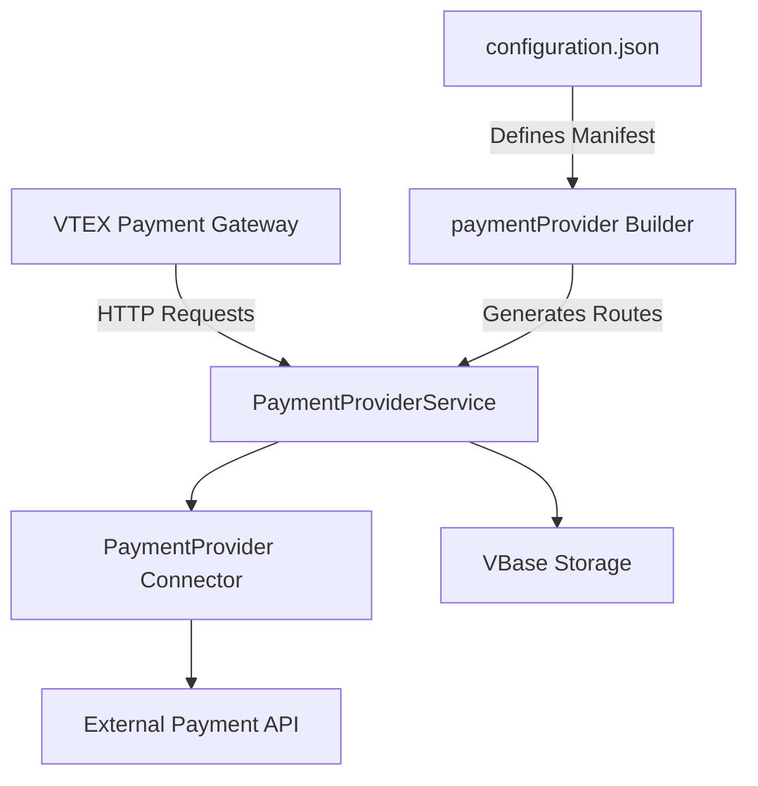

The VTEX Payment Provider Example framework is built on VTEX IO and uses a modular architecture to simplify payment connector development.

## System components

The framework consists of several key components that work together:



### PaymentProviderService

The `PaymentProviderService` is the main entry point for your connector. It extends VTEX's base `Service` class and automatically sets up all required protocol routes.

**Location**: `node/index.ts:5`

```typescript
import { PaymentProviderService } from '@vtex/payment-provider'
import TestSuiteApprover from './connector'

export default new PaymentProviderService({
  connector: TestSuiteApprover,
})
```

<Info>
The service automatically handles route registration, request parsing, and response formatting according to the Payment Provider Protocol.
</Info>

### PaymentProvider class

An abstract class that defines the interface your connector must implement. It provides:

- Method signatures for all protocol endpoints
- Helper methods for retry logic
- Type-safe request/response handling

**Location**: `node/connector.ts:36`

```typescript
export default class TestSuiteApprover extends PaymentProvider {
  public async authorize(
    authorization: AuthorizationRequest
  ): Promise<AuthorizationResponse> {
    // Your implementation
  }

  public async cancel(
    cancellation: CancellationRequest
  ): Promise<CancellationResponse> {
    // Your implementation
  }

  public async refund(refund: RefundRequest): Promise<RefundResponse> {
    // Your implementation
  }

  public async settle(
    settlement: SettlementRequest
  ): Promise<SettlementResponse> {
    // Your implementation
  }

  public inbound: undefined
}
```

### Builder system

The framework uses two VTEX IO builders:

<Tabs>
<Tab title="paymentProvider builder">
The `paymentProvider` builder (version 1.x) provides:

- Automatic route generation for manifest and payment-methods endpoints
- Policy injection for Payment Gateway API callbacks
- Integration with VTEX's payment infrastructure

**Configuration**: `manifest.json:8`

```json
"builders": {
  "paymentProvider": "1.x",
  "node": "6.x"
}
```
</Tab>

<Tab title="node builder">
The `node` builder (version 6.x) provides:

- TypeScript/JavaScript runtime environment
- Access to VTEX IO APIs and clients
- Service hosting and scaling

**Dependencies**: Uses `@vtex/payment-provider` package for protocol implementation.
</Tab>
</Tabs>

### VBase storage

VBase is VTEX's key-value storage system, used by connectors to persist payment data.

**Use case in connector**: `node/connector.ts:21`

```typescript
const authorizationsBucket = 'authorizations'

const persistAuthorizationResponse = async (
  vbase: VBase,
  resp: AuthorizationResponse
) => vbase.saveJSON(authorizationsBucket, resp.paymentId, resp)

const getPersistedAuthorizationResponse = async (
  vbase: VBase,
  req: AuthorizationRequest
) =>
  vbase.getJSON<AuthorizationResponse | undefined>(
    authorizationsBucket,
    req.paymentId,
    true
  )
```

<Note>
VBase persistence is essential for implementing the retry mechanism correctly. When VTEX retries an authorization request, your connector must return the same response consistently.
</Note>

## Request lifecycle

Here's how a payment authorization flows through the system:

<Steps>

<Step title="VTEX Payment Gateway sends request">
The gateway sends an HTTP POST to your connector's `/payments` endpoint.
</Step>

<Step title="PaymentProviderService receives request">
The service validates the request and routes it to your connector's `authorize` method.
</Step>

<Step title="Connector processes payment">
Your connector:
1. Checks VBase for existing responses (idempotency)
2. Determines the payment flow based on request data
3. Executes the appropriate flow logic
4. Persists the response to VBase
</Step>

<Step title="Response returned to gateway">
The service formats your response according to the protocol and returns it to VTEX.
</Step>

<Step title="Retry mechanism (if needed)">
For async payments, your connector calls the retry function, which triggers VTEX to request the payment status again.
</Step>

</Steps>

## Configuration architecture

The framework uses a two-layer configuration system:

### Layer 1: manifest.json

Defines your app's metadata and requirements.

**Location**: `manifest.json`

```json
{
  "name": "payment-provider-example",
  "vendor": "vtex",
  "version": "1.2.0",
  "title": "Payment Provider Example",
  "builders": {
    "paymentProvider": "1.x",
    "node": "6.x"
  },
  "policies": [
    { "name": "vbase-read-write" },
    { "name": "colossus-fire-event" },
    { "name": "colossus-write-logs" },
    {
      "name": "outbound-access",
      "attrs": {
        "host": "heimdall.vtexpayments.com.br",
        "path": "/api/payment-provider/callback/*"
      }
    }
  ],
  "billingOptions": {
    "type": "free"
  }
}
```

### Layer 2: configuration.json

Defines payment-specific configuration.

**Location**: `paymentProvider/configuration.json`

```json
{
  "name": "TestSuitApprover",
  "paymentMethods": [
    {
      "name": "Visa",
      "allowsSplit": "onCapture"
    },
    {
      "name": "Mastercard",
      "allowsSplit": "onCapture"
    }
  ],
  "customFields": [
    {
      "name": "Client ID",
      "type": "text"
    },
    {
      "name": "Secret Token",
      "type": "password"
    }
  ]
}
```

<Warning>
Changes to `configuration.json` require republishing your app. The paymentProvider builder reads this file at build time.
</Warning>

## Policies and permissions

Your connector requires specific policies to function:

| Policy | Purpose |
|--------|----------|
| `vbase-read-write` | Store and retrieve payment data |
| `colossus-fire-event` | Emit events for logging and monitoring |
| `colossus-write-logs` | Write application logs |
| `outbound-access` | Call Payment Gateway callback endpoints |

<Info>
The `paymentProvider` builder automatically adds policies for Payment Gateway API callbacks. You only need to declare additional outbound access if calling external payment APIs.
</Info>

## Extending the architecture

You can extend the base architecture by:

### Adding custom routes

```typescript
new PaymentProviderService({
  routes: customRoutes,
  connector: YourPaymentConnector,
})
```

### Adding custom clients

```typescript
new PaymentProviderService({
  clients: CustomClients,
  connector: YourPaymentConnector,
})
```

### Overriding default routes

Define custom paths in `node/service.json`:

```json
{
  "routes": {
    "authorize": {
      "path": "/_v/api/my-connector/payments",
      "public": true
    }
  }
}
```

<Warning>
Prefer using default generated routes. Custom routes require additional configuration in `configuration.json` and increase complexity.
</Warning>

## Best practices

1. **Use VBase for all state**: Never store payment data in memory; use VBase for persistence
2. **Handle idempotency**: Always check for existing responses before processing
3. **Log extensively**: Use the logging clients to track payment flows
4. **Test thoroughly**: Use the test suite to validate your implementation
5. **Follow the protocol**: Stick to the standard response formats and status values